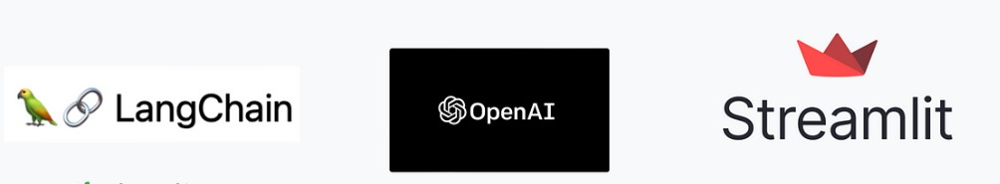

#  Gaurav Verma A
## Project Portfolio 🚀

This repository contains a collection of my projects.

## [Course Recommendation System using Udemy Dataset 📚](https://github.com/hi-gv/Udemy-course-Recommendation-System)

- Developed a cutting-edge course recommendation system utilizing the Udemy dataset sourced from Kaggle, leveraging course titles and descriptions for enhanced accuracy.
- Employed a powerful tech stack comprising Python, Pandas Dataframes, Scikit-learn, and Cosine Similarity Matrix to ensure robustness and effectiveness in generating personalized course recommendations.

<br>

## [Web Scraping of Indeed Jobs site 🔍](https://github.com/hi-gv/IndeedScrapper)

- Spearheaded a dynamic project focused on web scraping from 'indeed.co.in,' specifically targeting data science job listings and generating comprehensive CSV reports.
- Leveraged advanced Python programming skills in conjunction with the Selenium WebDriver to efficiently extract and process job data, ensuring accuracy and completeness in the generated reports.

<br>

## [BookMyShow Ticket Availability WhatsApp Alerting for Movie Openings 🎥](https://github.com/hi-gv/Whatsapp-Alert-when-tickets-available-on-BookMyShow)
- Successfully executed a practical project addressing a critical user case: developing a WhatsApp alerting system that promptly notifies users whenever the booking for Spiderman movie opens on BookmyShow, despite the absence of official APIs.
- Employed Python programming expertise, alongside pywhatkit and Selenium WebDriver, to ensure seamless integration and timely delivery of alerts, enhancing the movie-going experience for enthusiasts.

<br>

## [Exploratory Data Analysis on Zomato Dataset 🍴](https://github.com/hi-gv/Exploratory-Data-Analysis-Zomato)

- Successfully conducted Exploratory Data Analysis (EDA) on the Zomato dataset, demonstrating proficiency in handling and cleaning messy data and uncovering insightful relationships between various fields through impactful visualizations.
- Skillfully utilized Pandas, Seaborn, and Pandas-Profiling to effectively analyze the data, providing valuable insights to inform data-driven decision-making.

<br>

## [Streamlit app integration with OpenAI ChatGPT APIs 💬](https://github.com/hi-gv/ChatGPT-APIs--Streamlit--Lotte-Animation)

- Leveraged Streamlit to create an intuitive user interface, enabling seamless access to OpenAI ChatGPT API's for four key features: explaining Python code, executing SQL queries, conducting sentiment analysis, and performing grammar checking.
- Enhanced user experience and visual appeal by integrating Lotte animations, elevating the overall professionalism of the application.

<br>

## [gvBOT - Upload your PDF and Ask Qs using LLMs 🤖](https://github.com/hi-gv/gvBot---QA-PDF)
- Employed Langchain and OpenAIEmbeddings technologies to enable seamless user interactions, empowering them to upload PDFs and engage in conversational queries through a streamlined Bot interface using Streamlit.

<br>

## [Explored different automated Exploratory data analytics libraries like d-tale, pandas-profiling 📊](https://github.com/hi-gv/Exploratory-Data-Analytics-Tools)

- Received a prominent star on GitHub from the creator of D-tale library for an insightful Jupyter notebook.
- Extensively explored various automated Exploratory Data Analysis libraries, showcasing a commitment to staying up-to-date with the latest advancements in the field.

<br>

Feel free to explore the individual project by clicking for more details and code implementations.
Let's connect on [LinkedIn](https://www.linkedin.com/in/hi-gv/) 👋


```
```
